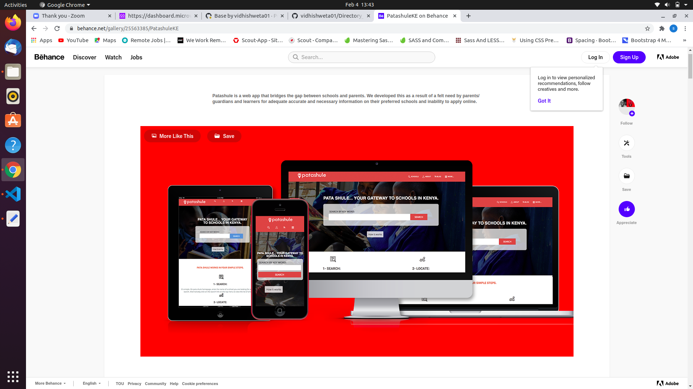
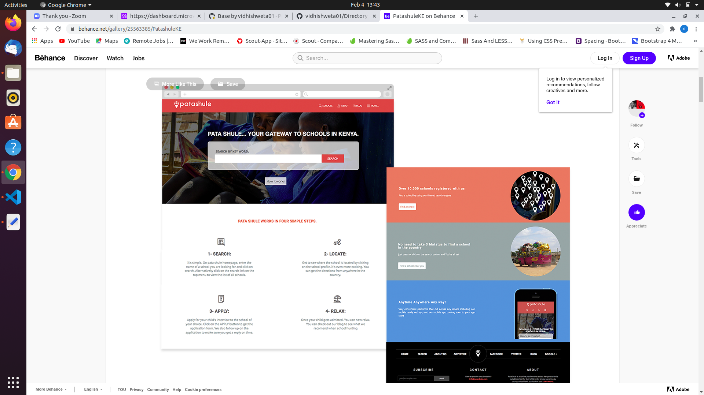
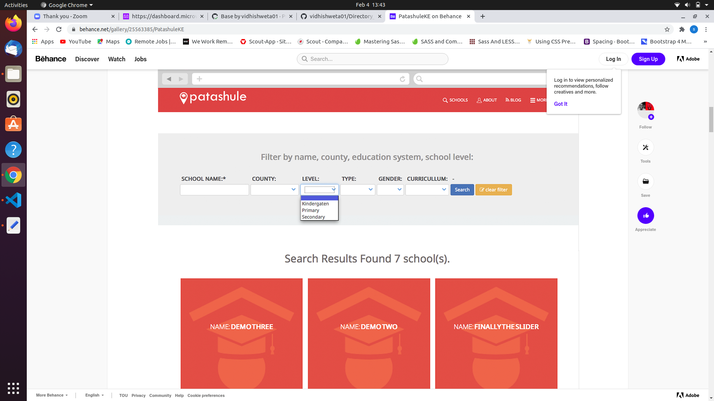
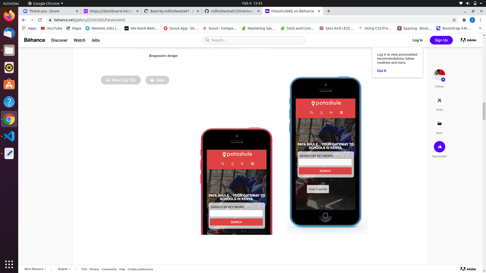
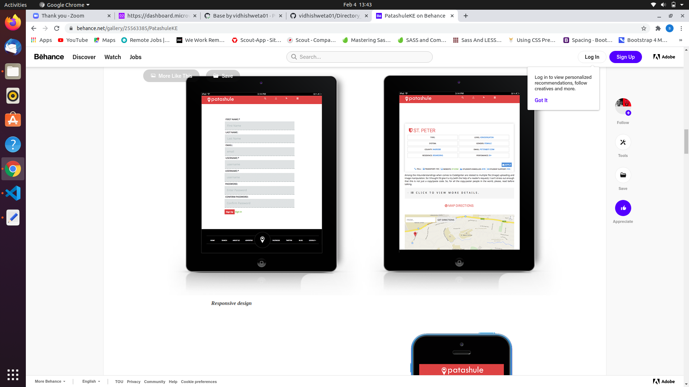
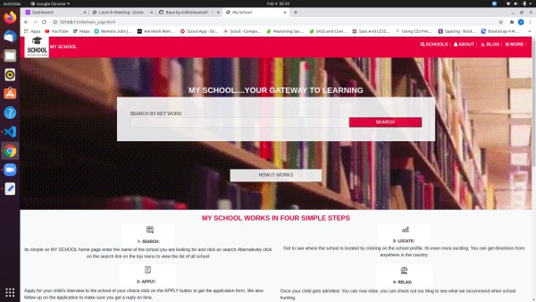
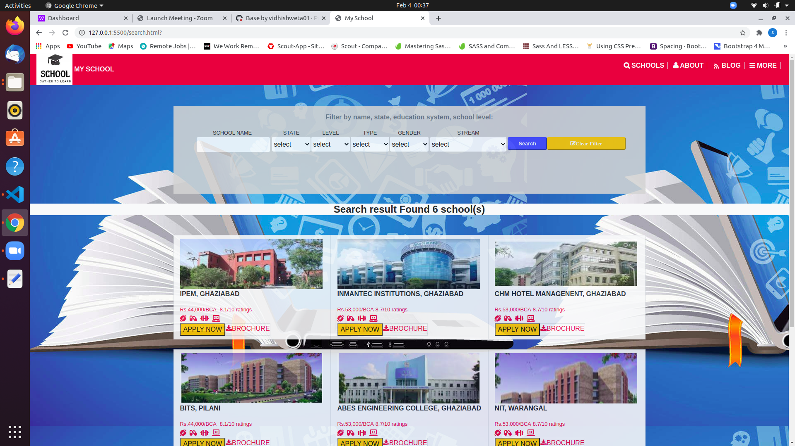
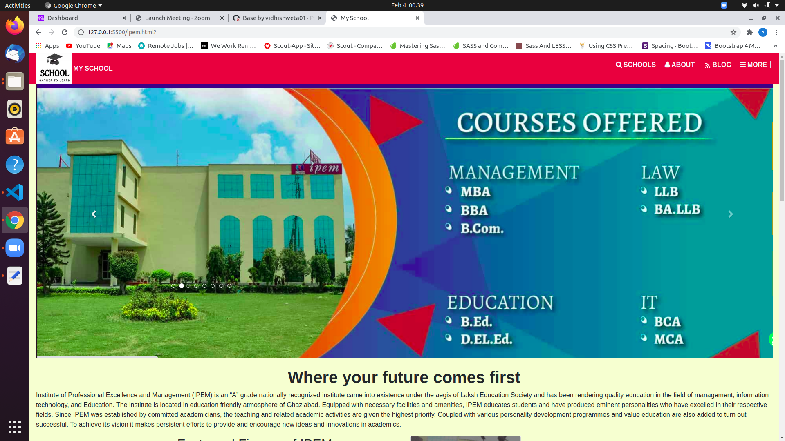
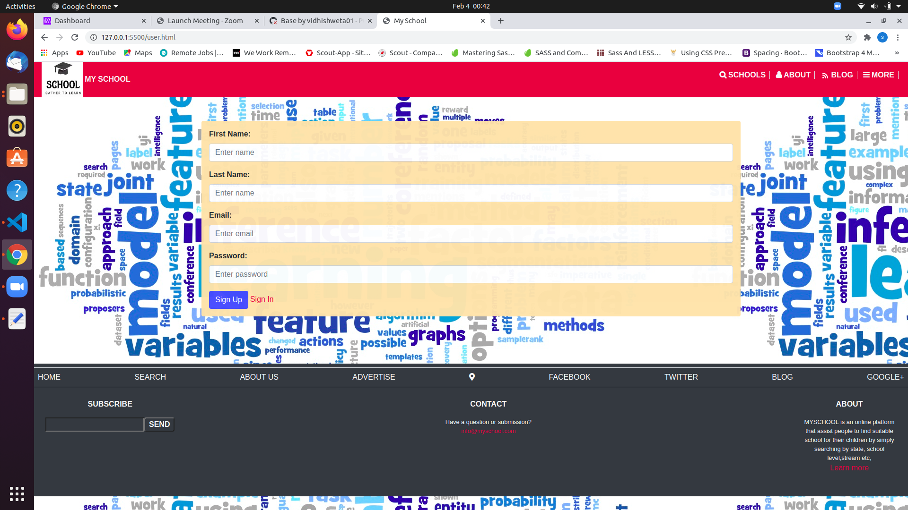

# Directory_of_school

Directory_of_school, is the capstone project inspired by above mentioned designed for week 4 Microverse Html, CSS, Bootstrap curricullum.

This is a project for the Microverse training program, Week 4, and it aims to use the HTML, CSS and Bootstrap to create a website part with is a inspiration of Directory_of_school. Here there are 4 pages - main, search, user & ipem. these are interlink among itself. 

index.html is the main page, contains search button along with links to all pages.

search page contains different colleges as a results of search.

its a college page with description about it.

its a user page which contains a form for user info.

## Built With

HTML
CSS
BOOTSTRAP 4

## Live Demo

[Try a lıve demo](https://vidhishweta01.github.io/Directory_of_Schools/)

## Authors 👤

### Shweta Srivastava

_[Github](https://github.com/vidhishweta01)

_[LinkedIn](http://linkedin.com/in/shweta-s-15a57070)

## Show your support ⭐️⭐️

Give a star if you like this project!

## License 📝

This project is [MIT](https://www.mit.edu/~amini/LICENSE.md) licensed.
